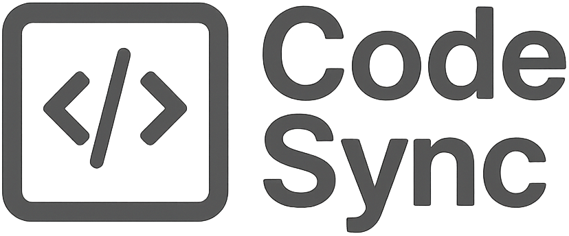

<p align="left">
  
</p>


<div align="left" style="font-size: 1.25em;">
<table style="font-size: 0.2em;">
<tr>
<td></td>
<td><h2> J.S.Repo </h2></td>
</tr>
</table>
</div>

---

## 🚀 프로젝트 개발 목적

---

🌟 **Code Sync** 프로젝트는 파일 및 저장소 동기화, 협업, 버전 관리, 그리고 직관적인 UI를 중심으로 개발된 팀 프로젝트입니다.  
🛡️ **안전하고 효율적인 협업 환경**을 구축하며, 사용자 친화적인 인터페이스를 통해 누구나 쉽게 사용할 수 있는 시스템을 제공합니다.  
⚡ **동시 접속과 실시간 데이터 처리**, 그리고 **안전한 데이터 보호**까지 고려한 완성도 높은 소프트웨어를 목표로 합니다.  

---

## 👥 팀 구성 및 역할

| 학년/반 | 학번      | 이름   | 역할                      |
| ------- | --------- | ------ | ------------------------- |
| 2-B     | 202245066 | 진승현 | 클라이언트 및 GUI 개발    |
| 2-C     | 202245087 | 신재창 | 서버 및 데이터베이스 개발 |

---

## 📦 프로젝트 구조

```
src/
├── icons/                       # 아이콘 이미지 폴더
│
├── models/                      # 데이터 모델
│   ├── FileInfo.java            # 파일 정보 관리
│   ├── Repository.java          # 저장소 데이터 처리
│   └── User.java                # 사용자 정보 처리
│
├── utils/                       # 유틸리티 클래스
│   ├── Rounded/                 # 둥근 UI 요소
│   │   ├── RoundedButton.java   # 둥근 버튼
│   │   └── RoundedBorder.java   # 둥근 테두리ㅁ
│   ├── ClientSock.java          # 클라이언트 소켓 통신
│   ├── IconConv.java            # 아이콘 색상 처리
│   └── Style.java               # 공통 스타일 관리
│
├── views/                       # 화면(UI) 구성
│   ├── login_register/          # 로그인 및 등록 화면
│   │   ├── LRCover.java
│   │   ├── LRFunc.java
│   │   ├── LRMain.java
│   │   └── LRView.java
│   │
│   ├── MainView/                # 메인 화면
│   │   ├── MainFunc.java
│   │   └── MainView.java
│   │
│   ├── repository/              # 저장소 관련 화면
│       ├── ColView.java         # 컬렉션 뷰
│       ├── FreezingView.java    # 프리징(동결) 뷰
│       ├── RepoFunc.java        # 저장소 기능 처리
│       └── RepoMainPanel.java   # 저장소 메인 패널
```

---

## 🗓️ 개발 일정 및 현황

- 🗓️ **5/17**: 데이터베이스 및 기본 GUI 구성 완료
- 🗓️ **5/18**: ClientSock 추가 및 서버 연결 확인, 온라인 통신 테스트
- 🗓️ **5/20**: 저장소, 다운로드, 삭제 기능 구현
- 🗓️ **5/21**: UI 개선 및 리팩토링, 파일 구조 정리
- 🗓️ **5/22**: 회원가입 복잡도 검사, 콜라보 추가/삭제/목록 구현, 프로그레스바 추가
- 🗓️ **5/23**: 파일 탐색기 디자인 개선
- 🗓️ **5/25**: 다운로드 속도 개선, 로컬 저장소 추가, UI 개선 및 풀 푸시 기능 추가
- 🗓️ **5/26**: 버튼 오버 효과 추가, 버그 수정
- 🗓️ **5/27**: 로그인/회원가입 화면, 메인/저장소 화면 통합 및 애니메이션 구현, 프리징 및 병합 기능 추가
- 🗓️ **5/28**: 로그아웃 시 멈춤, 서버 푸시 멈춤 현상 해결 및 저장소 생성, 메뉴, 검색 UI 변경
- 🗓️ **5/29**:

---

## 🎯 애플리케이션 주요 기능

### 클라이언트

- **직관적이고 현대적인 GUI 제공**
  - 사용자 친화적인 인터페이스와 애니메이션 효과로 뛰어난 사용성 제공
- **실시간 파일 및 저장소 관리**
  - 파일 업로드, 다운로드, 삭제, 이름 변경 등 다양한 파일 관리 기능
  - 멀티 저장소 및 폴더 구조 지원으로 대규모 프로젝트 관리 가능
  - 파일 상태(수정됨, 최신, 충돌 등) 실시간 표시
- **프리징(동결) 및 병합(Merge) 기능**
  - 중요한 파일 또는 버전을 동결하여 무결성 보장
  - 동결된 파일에 대한 병합 요청 및 승인 절차 지원
  - 충돌 발생 시 시각적 비교 및 선택적 병합 지원
- **협업 기능**
  - 프로젝트별 협업자 초대, 권한 관리
- **강력한 보안 및 인증**
  - 암호화된 통신 및 안전한 로그인/회원가입 시스템
  - 비밀번호 복잡도 검사 및 자동 로그아웃 등 보안 강화

### 서버

- **확장성 높은 서버 아키텍처**
  - 멀티스레드 기반으로 다수의 동시 접속 클라이언트 지원
  - 안정적인 네트워크 연결과 효율적인 리소스 관리
- **데이터베이스 연동 및 트랜잭션 관리**
  - MySQL 기반 사용자, 저장소, 파일 정보의 안전한 저장 및 조회
  - 트랜잭션 처리로 데이터 무결성 보장
- **고급 파일 동기화 및 버전 관리**
  - 클라이언트와 서버 간 실시간 파일 동기화
  - 파일 버전 관리 및 롤백, 충돌 감지 및 처리
- **네트워크 보안 및 관리 기능**
  - 암호화된 데이터 전송 및 인증 절차
  - 세션 및 연결 상태 모니터링, 비정상 접근 차단
- **관리자 및 모니터링 도구**
  - 서버 상태, 접속 로그, 사용량 통계 실시간 모니터링
  - 오류 및 이벤트 알림, 자동 백업 및 복구 지원

---

## 🖥️ 개발 환경

- 언어: Java
- 환경: macOS
- IDE: Eclipse, vsCode, NetBeans
- 버전: Java 11 이상
- UI: Swing, Java2D
- Maven:

```
<dependencies>
	<dependency>
            	<groupId>com.fifesoft</groupId>
            	<artifactId>rsyntaxtextarea</artifactId>
            	<version>3.6.0</version>
        </dependency>

        <dependency>
            	<groupId>org.projectlombok</groupId>
            	<artifactId>lombok</artifactId>
            	<version>1.18.38</version>
            	<scope>provided</scope>
        </dependency>

        <dependency>
            	<groupId>mysql</groupId>
            	<artifactId>mysql-connector-java</artifactId>
            	<version>8.0.33</version>
	</dependency>

	<dependency>
             	<groupId>org.json</groupId>
             	<artifactId>json</artifactId>
             	<version>20210307</version>
	</dependency>

    	<dependency>
        	<groupId>com.miglayout</groupId>
        	<artifactId>miglayout-swing</artifactId>
        	<version>5.3</version>
    	</dependency>

    	<dependency>
        	<groupId>net.java.dev.timingframework</groupId>
        	<artifactId>timingframework</artifactId>
        	<version>1.0</version>
    	</dependency>

</dependencies>
```

---
